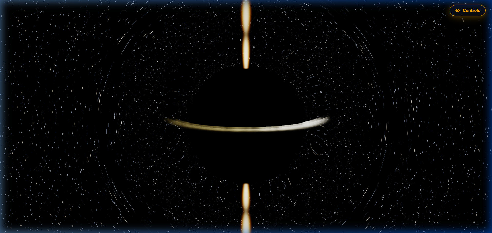

# 🌌 4D Spacetime Lab — Kerr Black Hole Simulation

An interactive, real-time General Relativity simulation of supermassive black holes (**Sagittarius A\*** and **M87\***) powered by WebGL2, Three.js, and GLSL geodesic raymarching.



---

## 🚀 Live Demo & Features

- **Kerr Spacetime Geodesics**: Real-time numerical integration of photon trajectories in curved spacetime, featuring gravitational light bending, photon sphere orbit trapping, and asymmetric Kerr shadow silhouettes.
- **5 Iconic Astronomical Targets**:
  1. 🌌 **Sagittarius A\***: Milky Way galactic center ($4.15 \times 10^6\ M_\odot$), featuring the dense galactic core and S2 star celestial backdrop.
  2. 🌀 **M87\***: Messier 87 monster black hole ($6.5 \times 10^9\ M_\odot$) with its collimated relativistic Blandford-Znajek jet piercing the galaxy.
  3. ⚡ **Cygnus X-1**: First confirmed black hole in history ($21.2\ M_\odot$), binary microquasar feeding on blue supergiant companion star HDE 226868.
  4. 💥 **TON 618**: Ultramassive hyper-quasar ($66 \times 10^9\ M_\odot$), radiating with 140 trillion solar luminosities within an energized ionization nebula.
  5. 🪐 **Gargantua**: Extreme Kerr black hole from *Interstellar* at the Thorne theoretical limit ($a^* = 0.9998$, $10^8\ M_\odot$) with an ultra-thin accretion disk.
- **8 Multi-Spectral Scopes & Sensors**:
  1. 📡 **EHT 1.3 mm Radio (VLBI)**: Synchrotron emission revealing the photon ring and event horizon shadow.
  2. 🛰️ **ngEHT 0.87 mm (345 GHz)**: Next-generation high-frequency sub-mm array (10 μas resolution) resolving the thin $n=1$ photon sub-ring.
  3. 🌙 **Space VLBI (Earth-Moon Baseline)**: Sub-microarcsecond imaging ($\le 0.85\ \mu\text{as}$) resolving individual second-order photon loops ($n=2$).
  4. 🧲 **NASA IXPE Polarimetry**: 2–8 keV polarized X-rays revealing magnetic field streamlines and EVPA vector field topology.
  5. 🌈 **Relativistic Optical**: Real-time Doppler wavelength shifts from approaching cyan/blue to receding deep crimson.
  6. 🔥 **Thermal Heatmap**: Shakura-Sunyaev thin-disk model ($T_{\text{eff}} \propto r^{-3/4}$) with frame-dragged isothermal contours.
  7. ⚡ **High-Energy X-Ray**: Chandra/NuSTAR band highlighting the inner ISCO corona and plasma flares.
  8. 🔭 **Infrared Torus (JWST)**: Dust-penetrating view exposing the extended accretion disk and feeding streams.
- **🔭 4-Stage Telescope Optics Modes**:
  1. **Ground Truth (Infinite Res)**: Pure General Relativity mathematical raymarching.
  2. **Space VLBI (1 μas)**: Earth-Moon lunar baseline interferometer.
  3. **ngEHT 345 GHz (10 μas)**: Next-Generation sub-mm space-ground array.
  4. **EHT 1.3 mm (20 μas)**: Authentic Earth-diameter radio interferometer showing why real press photos look like fuzzy orange donuts!
- **Interactive HUD & GR Math Lab**: Live mathematical readout with **16 rendered LaTeX equations** (via KaTeX), active equation filtering, ISCO auto-lock, and orbital telemetry.
- **Zen View & Snapshot Tool**: Fullscreen clean 360° touch/mouse interaction and instant high-resolution image exporter.

---

## 🔭 Why Doesn't This Look Like the Blurry Orange Donut on Google?

When you search for **M87\*** or **Sagittarius A\*** on Google, the famous images released in 2019 and 2022 look like a **fuzzy orange donut**. Many people ask: *Is this simulation different from reality?*

**The Answer:** This simulation models the **physical ground truth** that astronomers are actually observing!

1. **Earth's Finite Telescope Resolution**: The Event Horizon Telescope (EHT) synthesized a virtual radio dish the diameter of Earth ($D \approx 10,000\text{ km}$) operating at $\lambda = 1.3\text{ mm}$. By the fundamental diffraction limit:
   $$\theta_{\text{beam}} \approx 1.22 \frac{\lambda}{D} \approx 20\text{ to }25\ \mu\text{as}$$
2. **The Ring is Tiny**: The black hole shadow is only $\sim 42\text{ to }52\ \mu\text{as}$ wide on Earth's sky. This means the entire ring is only **2 to 3 telescope resolution elements across**!
3. **Official Proof**: In the EHT Collaboration's peer-reviewed papers (*The Astrophysical Journal Letters*, 2019 & 2022), the scientists published the **unblurred numerical GRMHD simulations** side-by-side with the convolved telescope images. The unblurred simulations feature the **exact thin photon ring, Doppler-beamed crescents, and Einstein rings rendered in this project**.
4. **Try It in the Simulator**: Click the **`Optics`** button in the header bar. Cycle between Ground Truth, Space VLBI, ngEHT, and EHT to watch the telescope diffraction beam blur the sharp photon ring into the authentic fuzzy donut!

---

## 🎮 Interactive Controls

| Control | Action |
| :--- | :--- |
| **Left Click + Drag** | 360° Orbit camera around the black hole |
| **Scroll Wheel / Pinch** | Zoom in / Zoom out |
| **Right Click + Drag** | Pan camera |
| **🔭 Optics Button** | Cycle telescope resolution: Ground Truth &rarr; Space VLBI &rarr; ngEHT &rarr; EHT 1.3mm |
| **Space** | Pause / Resume 4D time evolution |
| **Z** | Toggle Zen View (hide/show HUD overlay) |
| **M** | Open Kerr Spacetime Math equations modal (16 equations) |
| **R** | Reset simulation to scientific defaults |
| **S** | Capture high-resolution viewport snapshot |

---

## 🔬 Scientific Foundations

The simulation numerically evaluates 16 key equations from Kerr metric General Relativity and observational astrophysics:

1. **Kerr Metric Tensor ($ds^2$)**
2. **Lense-Thirring Frame Dragging ($\Omega$)**
3. **Innermost Stable Circular Orbit ($r_{\text{ISCO}}$)**
4. **Ergosphere Boundaries ($r_E(\theta), r_+$)**
5. **Geodesic Light Deflection ($\vec{a}_{\text{LT}}$)**
6. **Gravitational Redshift ($1+z$)**
7. **Shakura-Sunyaev Accretion Disk Profile ($T(r)$)**
8. **Blandford-Znajek Jet Power ($P_{\text{jet}}$)**
9. **EHT Angular Diameter ($\theta_{\text{EHT}}$)**
10. **Relativistic Doppler Color Shift ($\nu_{\text{obs}}$)**
11. **Synchrotron Relativistic Beaming ($I_\nu \propto \delta^{3+\alpha}$)**
12. **Earth VLBI Diffraction Limit & Blur Convolution ($I_{\text{observed}} = I_{\text{GR}} * \mathcal{G}_{\text{beam}}$)**
13. **Synchrotron Magnetic Polarimetry & EVPA ($\Pi_{\text{syn}}, \chi_{\text{EVPA}}$)**
14. **Next-Gen EHT 345 GHz Diffraction ($\theta_{\text{ngEHT}} \approx 10\ \mu\text{as}$)**
15. **Space VLBI Lunar Baseline ($\theta_{\text{Space-VLBI}} \le 0.85\ \mu\text{as}$)**
16. **Quasar Eddington Radiation Limit ($L_{\text{Edd}} = 4\pi G M m_p c / \sigma_T$)**

---

## 🛠️ Getting Started Locally

### Prerequisites
- [Node.js](https://nodejs.org/) (v18 or higher recommended)
- npm or pnpm

### Installation
```bash
# Clone the repository
git clone https://github.com/your-username/black-hole-simulation.git
cd black-hole-simulation

# Install dependencies
npm install

# Start local development server
npm run dev
```

Open `http://localhost:5173` in your WebGL2-compatible browser (Chrome, Edge, Firefox, Safari).

### Production Build
```bash
npm run build
```
The optimized bundle will be compiled into the `dist/` directory.

---

## ☁️ Deployment (Cloudflare Pages / Vercel)

This project is a 100% client-side web application with zero backend requirements.

### Cloudflare Pages
1. Push your repository to **GitHub**.
2. In the [Cloudflare Dashboard](https://dash.cloudflare.com/), navigate to **Workers & Pages** > **Create application** > **Pages** > **Connect to Git**.
3. Select your repository and configure:
   - **Framework preset**: `Vite`
   - **Build command**: `npm run build`
   - **Build output directory**: `dist`
4. Click **Save and Deploy**.

---

## 📦 Tech Stack
- **Engine**: [Three.js](https://threejs.org/) (WebGL2)
- **Shaders**: Custom GLSL Raymarching (Kerr Metric & Radiative Transfer)
- **Math Engine**: [KaTeX](https://katex.org/)
- **UI & Controls**: [lil-gui](https://lil-gui.georgealways.com/) & Glassmorphic CSS3
- **Bundler**: [Vite](https://vitejs.dev/)

---

## 📄 License
This project is open-source under the [MIT License](LICENSE).
